# Keybindings
[TOC]

# OSX
## Keyboard
- Keyboard: Add US and set US
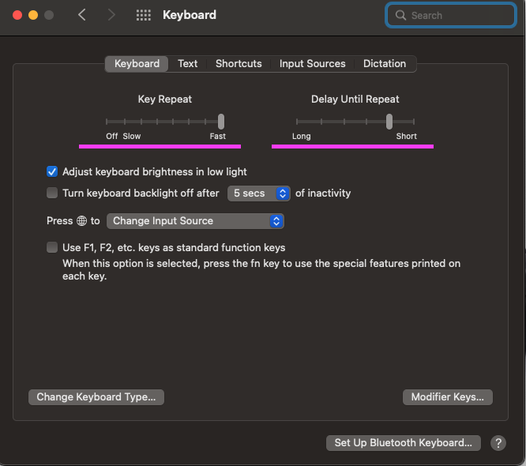
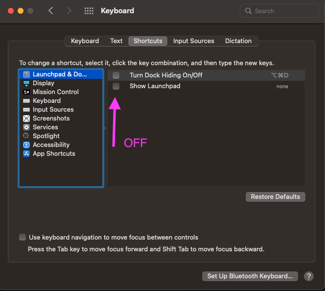
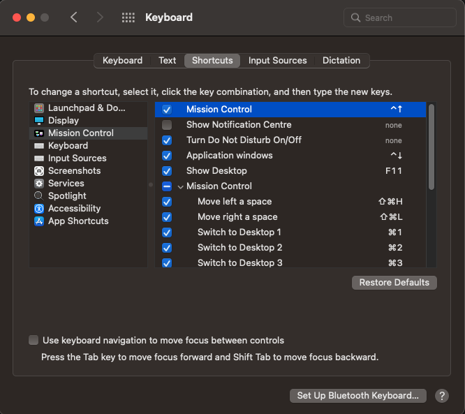

## Mission Control
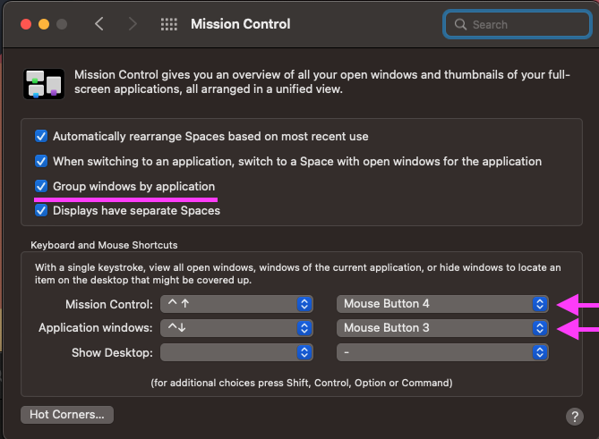

# Kitty Terminal
`CTRL + SHIFT + h` then `/` to search contents

# VIM
## TO LEARN
- [x] How to see the documentation of a given Ruby class and scroll the documentation
  - Use LSP, see bellow

## LSP
- `:Format` - Format the code
- `<leader>rn` - Rename methods, variables, etc
- `K`   - See code documentation of hovering code
- `K + K` - Enter code documentation window. `q` will exit

- `gd` - Go to definition
- `gr` - Go to references
- `gl` - Show line diagnostics (eg: Rubocop)

- These are not available in Ruby
- `gD` - Go to declaration
- `gi` - Go to implementation

## GitMessenger
Type :GitMessenger to show the commit msg for the line under the cursor

## GBrowse
- Select one or more lines and type :GBrowse to open the browser on that spot
- In vim-fugitive, select a commit and type :GBrowse to open it in the browser

## Utils
### Print HTML
With a document open and syntax run command `:TOhtml`.
A html document will be generated that can be used to print the code.

### Emmet
`CTRL + Y then ,` Expand

### Write/Read Markup
We need these plugins
```
Plug 'mzlogin/vim-markdown-toc'                                        " Language Support for Markdown - Generate table of contents
Plug 'iamcco/markdown-preview.nvim', { 'do': 'cd app & yarn install' } " Preview for Markdown TODO: Install nodejs and yarn
```

To read markup, open a markup file and run `:MarkdownPreview`.
Write `[TOC]` on the top of the document to see an auto generated Table of Contents


## Macros
Steps:
1 - Start the macro:
  - Put the cursor on the line we want to edit.
  - Press `q<some_letter>` to start the marco. Eg: `qa`
  - We should now read `recording @a` in the bottom.
2 - Do the work.
3 - End the macro:
  - Press `q`
4 - Play the macro:
  - Press `@<letter_with_macro>`. Eg: `@a`


## Buffers
- `:BOnly` - Close all buffers expect current. (added by: `Plug 'schickling/vim-bufonly'`)

## Select
### Code
- `vii` - Select inside block
- `viI` - Select inside block and wrapper

## Github (Plugin Vim Fugitive)
- `leader gs` - Open git status
- `s` - Stage
- `u` - UnStage
- `cc` - (Inside git status) commit
- `cc` - (Inside git status) commit -ammend

## Splits
~/dotfiles/v2/.config/nvim/my-config/keybinding_splits.vim
- `leader + th`   - change split to vertical
- `leader + tk`   - change split to horizontal
- `ctrl + w then |` expand view horizontally
- `ctrl + w then _` expand view vertically
- `ctrl + w then =` normalise splits

## Tabs
- `:tabs`     - List Tabs
- `:tabnew`     - Create New tab
- `:tabp`       - Go to previous Tab
- `:tabNext`    - Go to next tab
- `{count}gt`   -  Go to tab page {count}.
- `<C-l>`       - Go to tab on the left
- `<C-h>`       - Go to tab on the right

## Folding
- `zM` - Close all folds
- `zm` - Increase Folding by 1
- `zr` - Reduce Folding by 1
- `zR` - Open all folds
- `zA` - Toggle Folding All under cursor
- `za` - Toggle Folding Section under cursor
- `:set foldlevel=3` - Set fold level

# Amethyst
```
mod1 = Shift + Option
mod2 = Shift + Option + Ctrl

mod1 + t      Toggle Floating/Tilling
mod1 + Enter  Swap focus window to Main

mod1 + space  cycle to next layout
mod2 + space  cycle to next layout backwards
mod2 + A      Tall Layout
mod2 + S      Middle Column
mod2 + D      Fullscreen Layout
mod2 + W      Wide Layout

mod1 + K      Move Focus Clock Wise
mod1 + J      Move Focus Counter Clock Wise
mod2 + K      Swap Focus Window Clock Wise
mod2 + J      Move Focus Window Counter Clock Wise

mod1 + L      Expand
mod1 + H      Shrink

mod2 + O      Move Focus to other Screen Clockwise
mod2 + L      Swap Focus Window to Next Screen Clock Wise
mod2 + H      Swap Focus Window to Next Screen Counter Clock Wise
```
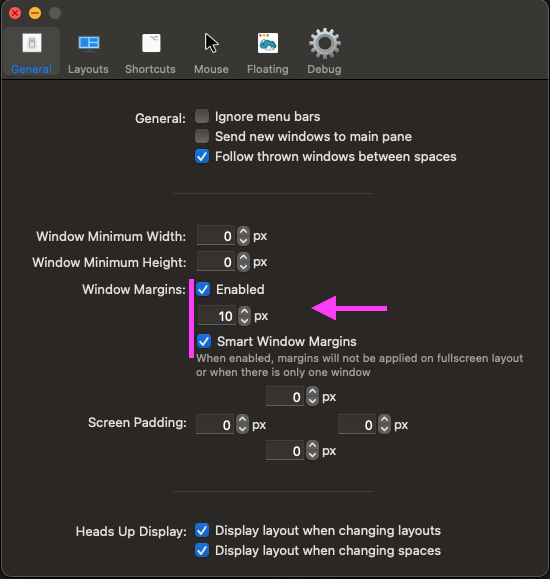
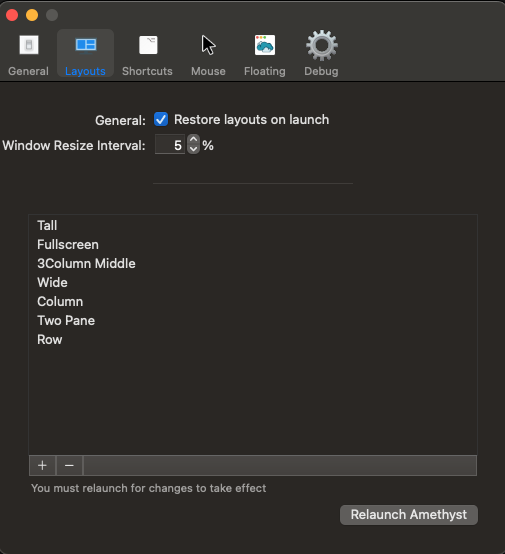
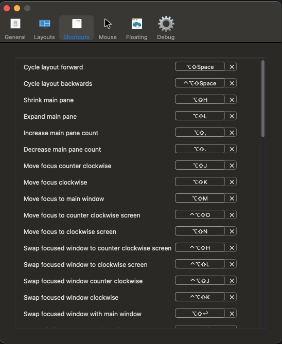
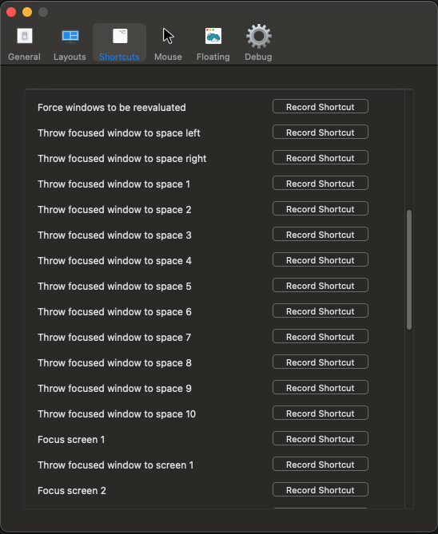
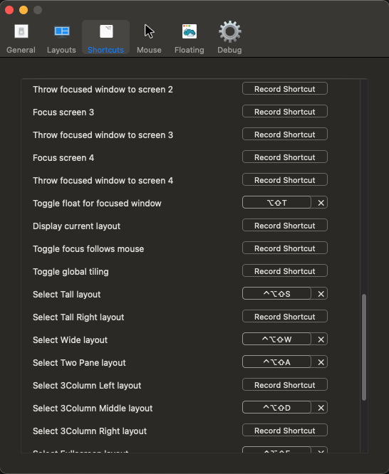
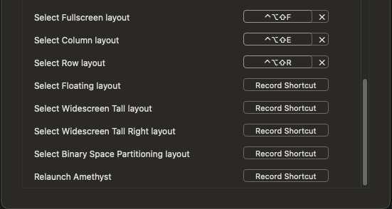
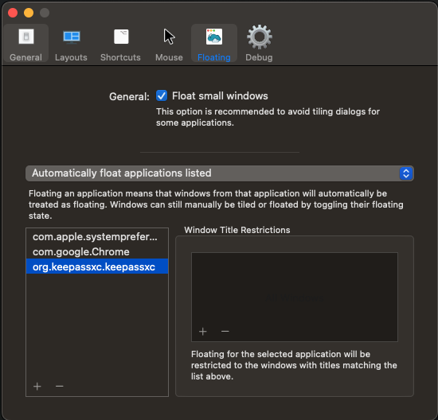

